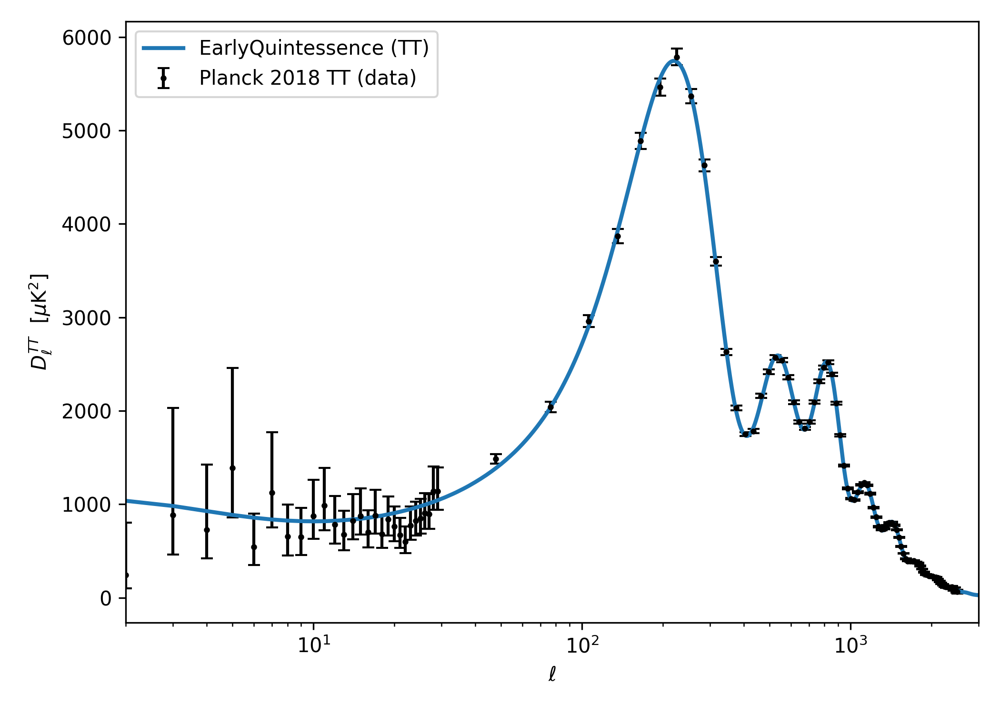

# CMB TT Spectrum — Early Quintessence Best-Fit

[](https://doi.org/10.5281/zenodo.17681763)

**Author:** Cherian Parangot Ittyipe 
**Cardiff MSc Astrophysics (Merit, 2024)**

---

## What this repository does

Plots the CMB TT power spectrum generated by CAMB using the posterior
mean parameter set from a Bayesian MCMC inference of the Early
Quintessence (EDE) model against Planck 2018 bandpowers.

It does **not** run MCMC or perform parameter inference.
For the full inference pipeline, see the companion repository:

→ **[cmb-ede-mcmc](https://github.com/Cherian-pi/cmb-ede-mcmc)**
— emcee + CAMB inference of 10 EDE parameters against Planck 2018 TT+TE+EE

---

## Key result



The plotted parameters (`params.json`) are the MCMC posterior mean from
the companion repo. Key EDE constraints from the Cardiff MSc thesis:

| Parameter | Value |
|-----------|-------|

| $H_0$ | 69.56 ± 0.93 km/s/Mpc |
| $f_\mathrm{EDE}(z_c)$ | 0.083 ± 0.024 |
| $\log_{10} z_c$ | 3.47 ± 0.10 |
| $n$ | 2.95 ± 0.24 |

---

## Usage

```bash
pip install camb astropy matplotlib numpy
python plot_cmb_from_posterior.py \
    --fits /path/to/COM_PowerSpect_CMB_R2.02.fits \
    --params params.json
```

---

## Related work

- **Thesis:** [DOI:10.5281/zenodo.17681763](https://doi.org/10.5281/zenodo.17681763)
- **Inference pipeline:** [cmb-ede-mcmc](https://github.com/Cherian-pi/cmb-ede-mcmc)
- **EarlyQuintessence model:** Smith, Poulin & Amin 2020 ([arXiv:1908.06995](https://arxiv.org/abs/1908.06995))
- **Planck 2018:** Aghanim et al. 2020 ([arXiv:1807.06209](https://arxiv.org/abs/1807.06209))
